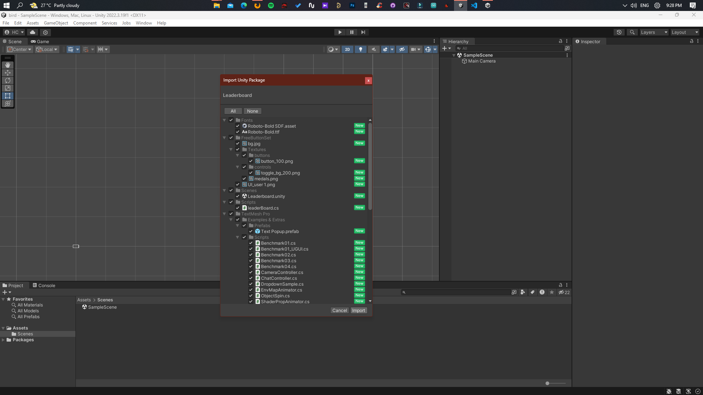

1. Download this package and drag it to a new or existing Unity Game Project/assets/scenes.  
2. Tick all the components (Add all new items including scripts) for import them.

3. Select the Leaderboard scene (newly added) and run it.

